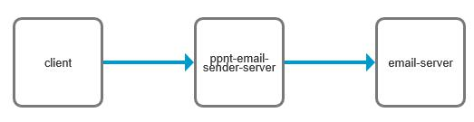

# ppnt-email-sender-server
基于jfinal开发的邮件发送服务,封装邮件发送的细节,对外提供发送邮件的http api接口  

## 接口文档
[https://www.apifox.cn/apidoc/project-938210](https://www.apifox.cn/apidoc/project-938210)

## 系统部署
1)前往release下载文件  
[https://gitee.com/ppnt/ppnt-email-sender-server/releases/](https://gitee.com/ppnt/ppnt-email-sender-server/releases/)  
2)解压文件  
3)启动项目  
windows启动执行
```
jfinal-start.bat
```
linux启动执行
```
jfinal.sh start
```